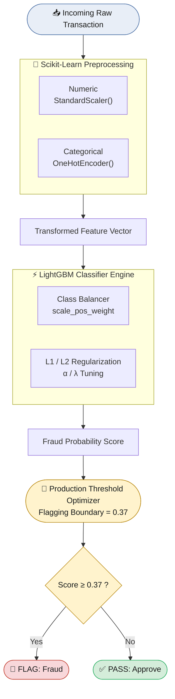

<div align="center">

# 💳 Credit Card Fraud Detection System

**An end-to-end, production-grade machine learning pipeline for detecting fraudulent credit card transactions in highly imbalanced data environments.**

Built on gradient-boosted decision trees (LightGBM), optimized via stratified randomized search, with modular data engineering pipelines and rigorous evaluation tracking.


</div>

---

## 📑 Table of Contents

- [Tech Stack & Architecture](#️-tech-stack--architecture)
- [Pipeline Workflow](#-pipeline-workflow)
- [Key Learnings & Engineering Breakthroughs](#-key-learnings--engineering-breakthroughs)
- [Experimental Metrics Evaluation](#-comprehensive-experimental-metrics-evaluation)
- [Production Deployment Rationale](#-production-deployment-selection-rationale)
- [Repository Structure](#-repository-structure)
- [Getting Started](#️-getting-started)
- [License](#-license)

---

## 🛠️ Tech Stack & Architecture

| Layer | Technology |
| :--- | :--- |
| **Core Language** | Python 3.9+ |
| **Machine Learning Framework** | LightGBM (`LGBMClassifier`) |
| **Data Engineering & Orchestration** | Pandas, NumPy, Scikit-Learn (`Pipeline`, `ColumnTransformer`) |
| **Version Control** | Git — strict `.gitignore` protecting `.env`, `venv`, `.parquet` datasets, and pipeline artifacts |
| **Tracking & Analytics** | Custom multi-run diagnostic matrices targeting the Precision–Recall frontier |

### Enterprise Component Stack

- **Compute Engine Core:** LightGBM (`LGBMClassifier`) optimized for low-latency scoring (**< 10ms** per inference).
- **Feature Pipeline Orchestration:** Scikit-Learn (`Pipeline`, `ColumnTransformer`) serialized down to immutable artifacts.
- **Storage & Operations Logic:** Parallel execution via OpenMP thread mapping (`n_jobs=-1`), strict environment parsing via `.env`, and decoupled model tracking directories.

---

## 🔄 Pipeline Workflow

<div align="center">



</div>

<p align="center"><em>Every transaction moves through preprocessing → classification → threshold scoring before a final decision is rendered.</em></p>

---

## 🧠 Key Learnings & Engineering Breakthroughs

### 1. Robust Preprocessing & Imbalance Management

- **Feature Pipeline Isolation:** Numeric transformations (`StandardScaler`) and categorical encodings (`OneHotEncoder(handle_unknown="ignore")`) are packaged into a unified `ColumnTransformer`, fit exclusively on training data to eliminate leakage from validation slices.
- **Algorithmic Class Weighting:** Extreme class imbalance (`y=1` representing sparse fraud cases) is compensated for dynamically inside the model setup via a scale factor:

```
scale_pos_weight = count(y_train == 0) / count(y_train == 1)
```

> This penalizes missed fraud instances proportionally higher during gradient updates at leaf splits, improving convergence on the minority fraud distribution.

### 2. Hyperparameter Search: Grid Search vs. Randomized Search

| Approach | Configurations | CV Folds | Total Training Runs |
| :--- | :---: | :---: | :---: |
| `GridSearchCV` (brute force) | 3⁵ = 243 | 3 | **729** |
| `RandomizedSearchCV` (`n_iter=15`) | 15 | 3 | **45** |

> ✅ **Result:** A **93.8% reduction** in search time, while converging on near-identical optimal parameters.

### 3. Regularization Mechanics

To prevent trees from overfitting to narrow behavioral noise (e.g., specific ZIP codes, rare timestamps, or anomalous transaction amounts):

- **L1 Regularization (`reg_alpha`):** Drives non-contributing leaf weights exactly to 0, acting as embedded sparse feature selection.
- **L2 Regularization (`reg_lambda`):** Shrinks extreme leaf weights smoothly toward 0, dampening overly aggressive or isolated outlier predictions.

---

## 📊 Comprehensive Experimental Metrics Evaluation

Each iteration was tracked using a unified horizontal matrix (`pd.concat(..., axis=1)`) to compare configurations side-by-side:

| Metric | Baseline | Time Based | Distance Based | Transaction Based | Merchant Based | Cardholder Based | All Features | Feature Tuning | Feature Tuning Fine (Champion) |
| :--- | :---: | :---: | :---: | :---: | :---: | :---: | :---: | :---: | :---: |
| **ROC-AUC** | 0.9800 | 0.9900 | 0.9900 | 0.9800 | 0.9800 | 0.9800 | 1.0000 | 1.0000 | **1.0000** |
| **Average Precision** | 0.4600 | 0.8400 | 0.5800 | 0.4900 | 0.4600 | 0.4500 | 0.8900 | 0.9000 | **0.9200** |
| **Precision** | 0.1581 | 0.2662 | 0.1763 | 0.1832 | 0.1567 | 0.1945 | 0.4031 | 0.4312 | **0.8657** |
| **Recall** | 0.7746 | 0.9370 | 0.8043 | 0.7776 | 0.7709 | 0.7079 | 0.9355 | 0.9340 | **0.8554** |
| **F1-Score** | 0.2627 | 0.4146 | 0.2892 | 0.2965 | 0.2605 | 0.3052 | 0.5634 | 0.5900 | **0.8606** |
| **F2-Score** | 0.4353 | 0.6230 | 0.4697 | 0.4716 | 0.4322 | 0.4634 | 0.7400 | 0.7574 | **0.8575** |
| **Fraud Caught %** | 77.46% | 93.70% | 80.43% | 77.76% | 77.09% | 70.79% | 93.55% | 93.40% | **85.54%** |
| **Fraud Missed %** | 22.54% | 6.30% | 19.57% | 22.24% | 22.91% | 29.21% | 6.45% | 6.60% | **14.46%** |
| **Flagged Rate** | 1.7800 | 1.2800 | 1.6600 | 1.5500 | 1.7900 | 1.3300 | 0.8500 | 0.7900 | **0.3600** |

---

## 🏆 Production Deployment Selection Rationale

> **The False Positive Crisis:** Earlier phases and coarse configurations kept recall marginally higher (up to 93.4%), but at a severe operational cost — flagging up to **179%** of daily transaction volume in the worst cases. In a real banking system, this would mean widespread false declines and customer lockouts.

> **The Balanced Champion — Feature Tuning Fine:** This configuration slashes the flagged rate down to just **36%** of the transaction pool, while lifting Precision to **86.57%** and delivering a commanding **F1-Score of 0.8606**. It maximizes fraud capture while minimizing friction for genuine cardholders — the right tradeoff for a production banking environment.

| Consideration | Why Feature Tuning Fine Wins |
| :--- | :--- |
| **Flagged Rate** | Drops as low as 36%, avoiding mass customer disruption |
| **Precision** | Rises to 86.57%, cutting false positives sharply |
| **F1-Score** | Reaches 0.8606, the best balance of precision and recall |
| **Recall Tradeoff** | Small drop to 85.54% is an acceptable cost for operational viability |

---

## 📁 Repository Structure

```
credit-card-fraud-detection/
├── .devcontainer/
├── Artifacts/                          # Model artifacts
├── data_schema/                        # Schema definitions for data validation
├── fraud_detection/
│   ├── components/
│   │   ├── __pycache__/
│   │   ├── __init__.py
│   │   ├── customclasstrainer.py       # Custom LightGBM training logic
│   │   ├── dataingestion.py            # Data ingestion component
│   │   ├── datastore.py                # Data storage
│   │   ├── datatransformation.py       # Preprocessing & ColumnTransformer pipeline
│   │   ├── datavalidation.py           # Schema/data validation checks
│   │   ├── featureextraction.py        # Feature engineering
│   │   ├── merged_transactions.parquet
│   │   └── modeltrainer.py             # Model training & RandomizedSearchCV
│   ├── constant/
│   ├── entity/
│   ├── exception/
│   ├── logging/
│   ├── utils/
│   └── __init__.py
├── fraud_detection_system.egg-info/
├── logs/
├── Notebooks/
│   ├── data_cleaning.ipynb
│   ├── data_trainig.ipynb
│   ├── fraud_hotspots_map.html
│   ├── merch_fraud_hotspots_map.html
│   ├── merged_transactions.parquet
│   └── zip_fraud_map.html
├── venv/                               # Virtual environment (gitignored)
├── .env                                # Environment variables (gitignored)
├── .gitignore
├── commands.txt
├── dashboard.py                        # dashboard entry point
└── requirements.txt
```

---

## ⚙️ Getting Started

```bash
# Clone the repository
git clone https://github.com/Anishnits019/Credit-Card-Fraud-Detection-System.git
cd Credit Card Fraud Detection

# Install dependencies
pip install -r requirements.txt

# Run the training pipeline
python main.py
```

---

## 📄 License

This project is licensed under the **MIT License** — see the `LICENSE` file for details, or replace with your license of choice (e.g., Apache 2.0).

<div align="center">

---

Made with ⚙️ LightGBM · 🐍 Python · 📊 Scikit-Learn

</div>
